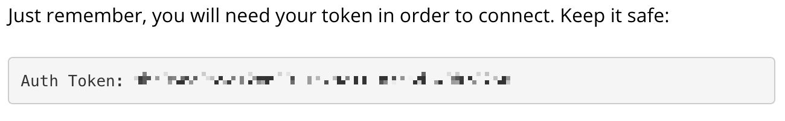

# Andra paket
Här är en kort introduktion till ett par andra paket som är lätta och roliga att använda.


## leaflet

med **leaflet** skapar vi enkelt kartor baserade på Google Maps. Observera här att i paketet **leaflet** finns också en funktion, `leaflet()`. Vi använder också paketet **ggmap** för att få hitta koordinater för platser, om vi inte vill gå till Google maps och hitta dem. Observera att du kommer behöva installera vissa paket, använd `install.packages("paketets namn")`

```{r,collapse=TRUE}
library(ggmap)
ggmap::geocode("ekonomikum")
```


```{r,collapse=TRUE}
library(leaflet)

m <- leaflet() # Funktionen leaflet
m <- addTiles(m)
m <- addMarkers(m,
                lng=17.61982,
                lat=59.85945,
                popup="Ekonomikum")
m
```

## rtweet
med **rtweet** laddar vi ner data på tweets från valfria hashtags eller användare. Vi får användarens profil, följare, antal retweets och mycket mer.


```{r,collapse=TRUE}
library(rtweet)
tweets <- search_tweets("#svpol", n = 10, include_rts = FALSE)
tweets$text[1]
tweets$profile_image_url[1]
```


## quantmod
```{r, echo=FALSE}
options("getSymbols.warning4.0"=FALSE)
```


Paket-författarna själva beskriver quantmod som ett "Quantitative Financial Modelling and Trading Framework for R". Det finns en mängd funktioner, med här demonstrerar jag hur du kan ladda ner data från enskilda aktier eller börsindex. Du behöver registrera dig på [tiingo.com](https://www.tiingo.com/) för att få en API-nyckel. Efter registrering, logga in och gå till

`API>Documentation>2.2.1 Daily Prices`

En bit ner på sidan hittar du din API-nyckel

```{r,echo=F}

```


```{r,echo=FALSE}
source("_ignore/key.R")
```


```{r, eval=F}
key <- "..............." # Byt ut .... mot din nyckel
```

Vi kan exempelvis ladda ner data Facebooks aktie, använd funktionen `getSymbols()`,
argumentet `src` är varifrån vi hämtar data, `api.key` är helt enkelt din API-nyckel. Data kommer sparas som ett objekt `FB`.

```{r,message=FALSE,warning=FALSE, collapse=TRUE}
library(quantmod)
getSymbols("FB", src = "tiingo",api.key = key) 
?getSymbols
```

Vi kan inspektera de fem senaste dagarna med `tail()`...

```{r,collapse=TRUE}
tail(FB, 5)
```

...och skapa en tidsserieplot med `plot()`

```{r,collapse=TRUE}
plot(FB$FB.Close,col="black")
```

Det är mycket som pågår *under the hood* här. Till exempel: hur vet funktionen `plot()` vad för sorts graf den ska rita, och var den ska leta efter tiden (som visas på x-axeln)? Går man in på djupet blir det snabbt väldigt komplicerat, och vi lämnar såldes denna diskussion tills vidare.

## dplyr

Här kommer jag introducera paketet **dplyr** som är ett fantastiskt intuitivt sätt att manipulera data. Först måste du i vanlig ordning installera paketet med `install.packages()`. Glöm inte citationstecken. Sedan

```{r,message=FALSE}
library(dplyr)
```


I dplyr finns ` %>% `. Med ` %>% ` (som kallas the pipe operator) behöver vi inte skriva det första argumentet i en funktion inuti själva funktionen. Det är mycket enklare att förstå med ett exempel. Notera hur dessa två funktioner (som avrundar `x` till en decimal) producerar samma resultat

```{r,collapse=TRUE}
x <- c(0.109, 0.359, 0.63, 0.996, 0.515, 0.142, 0.017, 0.829, 0.907)
round(x,1)
x %>% round(1)
```

I detta fallet går det så klart snabbare att bara skriva `round(x,1)`, men när du applicerar många funktioner på `x` så skall du snart se att du kan skriva mycket mer intuitiv kod med ` %>% ` 

```{r,collapse=TRUE}
round(exp(diff(log(x))), 1)
x %>% log() %>% diff() %>% exp() %>% round(1)
```

Framför allt är som sagt **dplyr** bra för datamanipulering. Den innehåller en rad bra funkltioner som jag demonstrerar nedan med hjälp av ett data set vi redan är bekanta med, `gapminder`. 
```{r}
library(gapminder)
gapminder
```

### `filter()`
Som du ser så har `gapminder` 6 kolumner och 1704 rader. Vi börjar med funktionen `filter()` som väljer observationer baserat på deras *värden*. Säg att vi är intresserade av data där landet är Sverige.

```{r}
gapminder %>% filter(country=="Sweden")
```

I stället för 1704 rader har vi nu bara 12, det vill säga alla värden där kolumnen `country` är lika med Sverige (`"Sverige"`).

### `select()`

Med select väljer vi helt enkelt kolumner baserat på deras namn. Vi har i vårt data set som sagt 6 kolumner, säg att vi är intresserade av endast en kolumn, nämligen den kolumn som heter `country`

```{r}
gapminder %>% select(country)
```

I sann ` %>% `-anda kan vi självklart kombinera funktionerna. Säg att vi är intresserade av data på Sverige, och vi bara vill ha två kolumner: år och förväntad livslängd

```{r}
gapminder %>%
  filter(country=="Sweden") %>% 
  select(year, lifeExp)
```

I första steget väljer vi alla rader där `country` är lika med `"Sverige"` och i andra steget väljer vi kolumnerna som heter `year` och `lifeExp`.


### `mutate()`
med `mutate()` skapar vi nya kolumner baserat på befintliga kolumner. Det vill säga, vi applicerar en funktion på en eller flera befintliga kolumner och skapar en ny. Vi har BNP per capita och vi har population, så vi skulle kunna skapa en ny kolumn, `gdp`, genom att multiplicera gdp per capita med population, i.e. `gdpPercap*pop`

```{r}
gapminder %>% 
  mutate(gdp = gdpPercap*pop)
```
