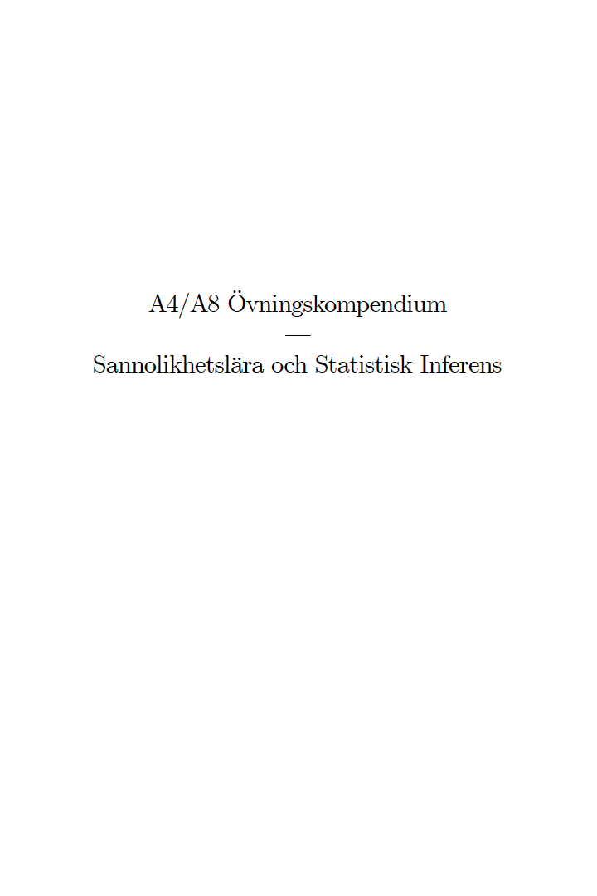
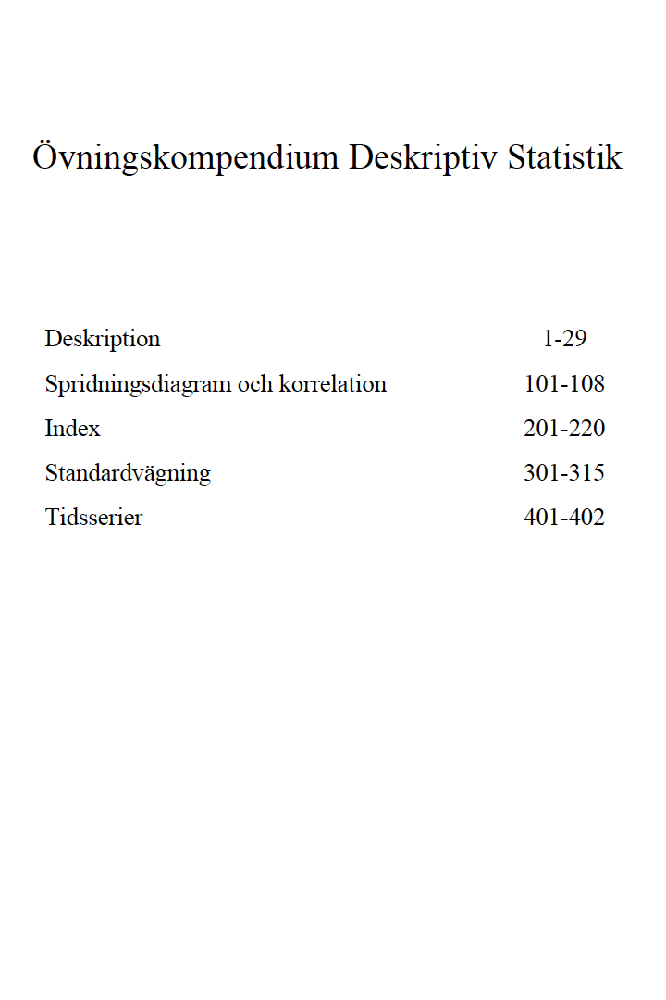

--- 
title: "Lösningar i R till vissa uppgifter från övningskompendierna (samt lite annat kul)"
author: "Erik Stenberg"
date: "`r Sys.Date()`"
site: bookdown::bookdown_site
output: bookdown::gitbook
documentclass: book
github-repo: shitoushan/losningar
description: "Lösningar för vissa uppgifter i kursen Statstik A4/A8"
always_allow_html: yes
keep_tex: yes
---

```{r include=FALSE}
# automatically create a bib database for R packages
knitr::write_bib(c(
  .packages(), 'bookdown', 'knitr', 'rmarkdown'
), 'packages.bib')

```


# Introduktion {#intro}
```{r,echo=FALSE,out.width = "300px",eval=FALSE}


```


## Motivering
Detta dokument är till för dig som läser kursen Statistik A4/A8 och är nyfiken på R. Innehållet är tänkt att förena lite nytta (lösa uppgifter) med nöje (lära dig lite R).

Det är inte meningen att detta dokument skall fungera som en heltäckande introduktion till programmeringsspråket R. Det finns mängder av väldigt välskrivna guider online som fokuserar mycket mer på hur språket är uppbygt. Lyckligtvis är R väldigt enkelt att komma igång med, och det krävs inte mycket förståelse för själva språket för att göra enkla beräkningar, skattningar av modeller, rita grafer och göra hypotestester. 


R är programmeringsspråket vi kommer använda, och vi kommer göra allt arbete i RStudio, som är en IDE (*Integrated Developer Environment*) för R. RStudio gör arbete med R mycket enklare. Du behöver både R och RStudio på din egen dator, eller använda någon av datorerna i labben.

[Här](http://tryr.codeschool.com) är en bra början för att lära dig syntaxen i R utan att behöva installera varker R eller RStudio. Om du har installerat R och RStudio, så är [swirl](http://swirlstats.com/students.html) ett ganska roligt sätt att lära sig.

## Varför R?
R är gratis, populärt och enkelt att komma igång med. Under det senaste årtiondet har populariteten växt enormt och i dag är R ett av de absolut mest använda verktygen för data-analys, både ute i verkligheten och inom forskningsvärlden. Om du någon gång tänkt skriva en uppsats i statistik, företagsekonomi nationalekonomi, eller någonting kvantitativt i vilket ämne som helst, kan R vara en bra vän att ha.

```{r, collapse=TRUE}
library(fortunes)
fortune('subway')
```
